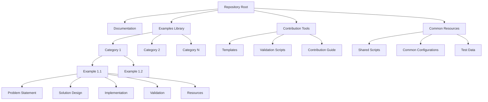

# Design Document: Datadog Q Examples Library

## Overview

The Datadog Q Examples Library is a structured collection of practical examples demonstrating how Q CLI and Datadog can be integrated to solve real-world operational problems. This design document outlines the architecture, components, and implementation approach for creating a maintainable, extensible library that allows multiple contributors while ensuring consistency and quality.

The library will focus on end-to-end workflows that showcase incident detection, analysis, resolution, and documentation using Q CLI and Datadog's capabilities. Examples will be organized in a way that makes them discoverable, understandable, and adaptable to different environments.

## Architecture

The architecture of the Datadog Q Examples Library follows a modular, content-focused approach:



### Key Architectural Decisions:

1. **Content-First Approach**: The architecture prioritizes content organization and discoverability over complex technical implementations.

2. **Modular Structure**: Each example is self-contained but follows a consistent structure, allowing for independent development and maintenance.

3. **Separation of Concerns**: Clear separation between example content, documentation, and contribution tooling.

4. **Minimal Dependencies**: Examples should have minimal external dependencies to ensure they remain functional over time.

5. **Progressive Disclosure**: Examples are structured to provide basic implementation first, with optional advanced configurations.

## Components and Interfaces

### 1. Repository Structure

```
datadog-q-examples/
├── README.md                 # Project overview and quick start
├── CONTRIBUTING.md           # Contribution guidelines
├── docs/                     # General documentation
│   ├── getting-started.md    # Getting started guide
│   ├── concepts.md           # Key concepts explanation
│   └── faq.md                # Frequently asked questions
├── examples/                 # Examples library
│   ├── incident-detection/   # Category: Incident Detection
│   ├── root-cause-analysis/  # Category: Root Cause Analysis
│   ├── remediation/          # Category: Remediation
│   └── end-to-end/           # Category: End-to-End Workflows
├── templates/                # Templates for new examples
│   ├── basic-example/        # Basic example template
│   └── advanced-example/     # Advanced example template
└── scripts/                  # Utility scripts
    ├── validate.sh           # Validation script for examples
    └── generate.sh           # Generator script for new examples
```

### 2. Example Structure

Each example will follow a consistent structure:

```
examples/category/example-name/
├── README.md                 # Overview, problem statement, and instructions
├── setup/                    # Setup scripts and configurations
│   ├── infrastructure/       # Infrastructure as code (if applicable)
│   └── datadog/              # Datadog configurations (dashboards, monitors)
├── data/                     # Sample data (if applicable)
├── scripts/                  # Implementation scripts
│   ├── detect.sh             # Detection scripts
│   ├── analyze.sh            # Analysis scripts
│   └── remediate.sh          # Remediation scripts
├── docs/                     # Example-specific documentation
│   ├── walkthrough.md        # Step-by-step walkthrough
│   └── advanced.md           # Advanced scenarios
└── tests/                    # Validation tests
```

### 3. Example README.md Template

Each example's README.md will follow this structure:

```markdown
# Example Title

## Problem Statement
[Clear description of the problem this example addresses]

## Prerequisites
- Required tools and versions
- Required access and permissions
- Environment assumptions

## Solution Overview
[Brief description of the approach and technologies used]

## Implementation Steps
1. Step 1: [Description]
2. Step 2: [Description]
...

## Expected Outcomes
[What users should expect to see when successfully implementing the example]

## Troubleshooting
[Common issues and their solutions]

## Further Reading
[Links to related documentation and resources]
```

### 4. Contribution Tools

The repository will include tools to facilitate contributions:

1. **Example Templates**: Pre-structured templates for different types of examples.
2. **Validation Scripts**: Scripts to validate that examples meet structural and quality requirements.
3. **Documentation Generator**: Tools to generate consistent documentation from example metadata.

## Data Models

### 1. Example Metadata

Each example will include metadata in a structured format:

```yaml
# metadata.yaml
title: "Detecting and Resolving Memory Leaks with Q CLI and Datadog"
description: "An end-to-end workflow for identifying memory leaks in Java applications using Datadog monitoring and Q CLI analysis"
categories:
  - "performance"
  - "java"
  - "memory-management"
difficulty: "intermediate"
time_required: "30 minutes"
environments:
  - "AWS"
  - "Kubernetes"
tools:
  - name: "Q CLI"
    version: ">=1.0.0"
  - name: "Datadog Agent"
    version: ">=7.0.0"
contributors:
  - name: "Jane Doe"
    github: "janedoe"
last_tested: "2025-05-15"
```

### 2. Category Taxonomy

Examples will be organized using a multi-dimensional taxonomy:

1. **Problem Domain**:
   - Performance Issues
   - Error Detection
   - Security Incidents
   - Resource Optimization

2. **Environment**:
   - AWS
   - GCP
   - Azure
   - Kubernetes
   - On-premises

3. **Application Type**:
   - Microservices
   - Monoliths
   - Serverless
   - Databases

4. **Difficulty Level**:
   - Beginner
   - Intermediate
   - Advanced

## Error Handling

### 1. Example Validation

- Each example will include validation steps to verify correct implementation.
- Examples will provide clear error messages and troubleshooting guidance.
- Setup scripts will include error handling with informative messages.

### 2. User Guidance

- Examples will include common error scenarios and their resolutions.
- Where appropriate, examples will demonstrate how to use Q CLI and Datadog for error diagnosis.

## Testing Strategy

### 1. Example Testing

- Each example will include validation tests to verify it works as expected.
- Examples will be tested in multiple environments where applicable.
- Automated testing will be implemented for structural validation.

### 2. Continuous Validation

- Examples will be periodically validated against the latest versions of Q CLI and Datadog.
- A CI/CD pipeline will run basic structural and syntax validation on contributions.

## Implementation Considerations

### 1. Discoverability

- The repository will include a searchable index of examples.
- Examples will be tagged with relevant metadata for filtering.
- Related examples will be cross-referenced.

### 2. Maintainability

- Examples will be designed to minimize version dependencies.
- Common configurations and scripts will be centralized to reduce duplication.
- Examples will follow a consistent style and structure.

### 3. Educational Value

- Examples will include explanatory comments and documentation.
- Complex concepts will be explained with diagrams where appropriate.
- Examples will progress from basic to advanced implementations.

### 4. Contribution Experience

- Clear templates and guidelines will streamline the contribution process.
- Automated validation will provide immediate feedback to contributors.
- The contribution process will be documented with examples.

## PRFAQ (Press Release and FAQ)

### Press Release

```
FOR IMMEDIATE RELEASE

Datadog and Q CLI Launch Comprehensive Examples Library for Real-World Problem Solving

NEW YORK, June 23, 2025 - Datadog, Inc., the monitoring and security platform for cloud applications, today announced the launch of the Datadog Q Examples Library, a comprehensive collection of practical examples demonstrating how Datadog's monitoring capabilities and Q CLI can be integrated to solve real-world operational challenges.

The Examples Library provides operations teams, developers, and site reliability engineers with ready-to-implement solutions for common problems such as performance bottlenecks, error detection, and incident response. Each example includes a complete workflow from problem detection through resolution and documentation, showcasing the power of combining Datadog's observability platform with Q CLI's intelligent analysis capabilities.

"Operations teams are constantly looking for ways to reduce mean time to detection and resolution for incidents," said [Executive Name], [Title] at Datadog. "The Examples Library provides battle-tested patterns that teams can immediately apply to their own environments, significantly reducing the learning curve for effective incident management."

Key features of the Datadog Q Examples Library include:

- End-to-end workflows covering the complete incident lifecycle
- Examples for multiple environments including AWS, GCP, Azure, and Kubernetes
- Progressive learning paths from basic to advanced implementations
- Contribution framework allowing community members to share their own solutions

The Examples Library is available now on GitHub at [repository URL] under an open-source license, allowing organizations to freely use, modify, and contribute to the examples.
```

### FAQ

**Q: Who is the target audience for the Examples Library?**

A: The primary audience includes operations engineers, developers, site reliability engineers, and DevOps practitioners who use or are considering using Datadog and Q CLI in their environments. The examples are designed to be valuable for both beginners looking to learn these tools and experienced users seeking advanced implementation patterns.

**Q: What types of problems do the examples address?**

A: The examples cover a wide range of operational challenges including performance optimization, error detection and resolution, security incident response, resource utilization, and automated remediation. Each example focuses on a specific, realistic scenario that operations teams commonly encounter.

**Q: How are the examples organized?**

A: Examples are organized by problem domain, environment type, and difficulty level. Users can browse categories or search for specific keywords to find relevant examples. Each example follows a consistent structure with problem statement, solution approach, implementation steps, and expected outcomes.

**Q: Can I contribute my own examples?**

A: Yes! The Examples Library is designed as a community resource with a clear contribution framework. Templates and guidelines are provided to help you structure your example, and a review process ensures all contributions meet quality standards.

**Q: How do I get started with the Examples Library?**

A: Start by browsing the examples to find one relevant to your needs. Each example includes prerequisites, step-by-step implementation instructions, and validation steps. You can follow the examples as-is or adapt them to your specific environment.

**Q: Are the examples maintained and updated?**

A: Yes, examples are periodically validated against the latest versions of Q CLI and Datadog. The community contribution model also allows for continuous improvement and updates as tools evolve.

**Q: Do I need to be a Datadog customer to use these examples?**

A: Many examples require a Datadog account to fully implement. However, the concepts and approaches demonstrated are valuable even if you're using different monitoring tools. Some examples may work with the free tier of Datadog.

**Q: How can I request a specific example if I don't see what I need?**

A: You can open an issue in the GitHub repository describing the scenario you'd like to see covered. The community and maintainers regularly review these requests to prioritize new examples.