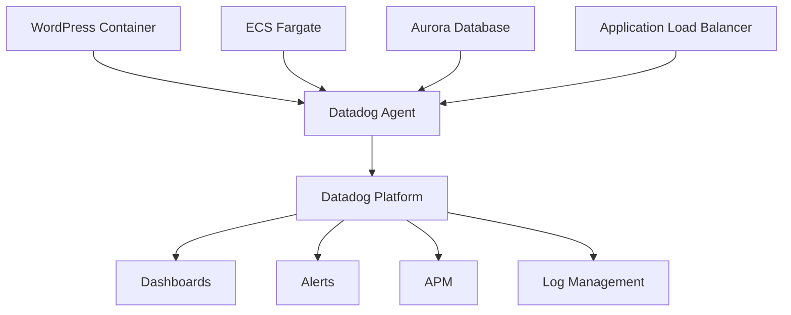

# Key Concepts and Educational Content

This document explains the fundamental concepts, technologies, and architectural patterns used in the serverless WordPress deployment. Understanding these concepts will help you better implement, troubleshoot, and extend the solution.

## Table of Contents

1. [Serverless Architecture Concepts](#serverless-architecture-concepts)
2. [AWS Services Deep Dive](#aws-services-deep-dive)
3. [Containerization and WordPress](#containerization-and-wordpress)
4. [Monitoring and Observability](#monitoring-and-observability)
5. [Incident Management Workflow](#incident-management-workflow)
6. [Security Considerations](#security-considerations)
7. [Performance Optimization](#performance-optimization)
8. [Cost Optimization](#cost-optimization)

## Serverless Architecture Concepts

### What is Serverless?

Serverless computing is a cloud execution model where the cloud provider manages the infrastructure, and you only pay for the compute resources you actually use. Despite the name, servers are still involved, but they're abstracted away from the developer.

**Key Characteristics:**
- **No server management**: No need to provision, patch, or maintain servers
- **Automatic scaling**: Resources scale up and down based on demand
- **Pay-per-use**: You only pay for actual resource consumption
- **Event-driven**: Applications respond to events and triggers

### Serverless vs. Traditional Architecture

| Aspect | Traditional | Serverless |
|--------|-------------|------------|
| **Infrastructure Management** | Manual server provisioning and maintenance | Fully managed by cloud provider |
| **Scaling** | Manual or auto-scaling groups | Automatic and instant |
| **Cost Model** | Pay for reserved capacity | Pay for actual usage |
| **Availability** | Requires redundancy planning | Built-in high availability |
| **Operational Overhead** | High (patching, monitoring, scaling) | Low (focus on application logic) |

### Benefits for WordPress

1. **Cost Efficiency**: Pay only when users access your site
2. **Automatic Scaling**: Handle traffic spikes without manual intervention
3. **High Availability**: Built-in redundancy across multiple availability zones
4. **Reduced Maintenance**: No server patching or maintenance windows
5. **Global Reach**: Easy to deploy across multiple regions

### Challenges and Considerations

1. **Cold Starts**: Initial request latency when scaling from zero
2. **Vendor Lock-in**: Tight coupling with cloud provider services
3. **Debugging Complexity**: Distributed systems are harder to debug
4. **State Management**: Stateless design requires external storage for persistence

## AWS Services Deep Dive

### Amazon ECS Fargate

**What it is**: A serverless compute engine for containers that removes the need to manage EC2 instances.

**Key Concepts**:
- **Task Definition**: Blueprint that describes how containers should run
- **Service**: Ensures desired number of tasks are running and healthy
- **Cluster**: Logical grouping of compute resources
- **Task**: Running instance of a task definition

**Why we use it for WordPress**:
```yaml
# Task Definition Structure
Task Definition:
  - Container: WordPress (PHP-FPM + Nginx)
    - CPU: 512 units (0.5 vCPU)
    - Memory: 1024 MB
    - Ports: 80 (HTTP)
    - Environment Variables: Database connection info
    - Volumes: EFS mount for persistent storage
  
  - Container: Datadog Agent (optional)
    - CPU: 128 units
    - Memory: 256 MB
    - Purpose: Metrics and log collection
```

**Scaling Behavior**:
```bash
# ECS Service Auto Scaling
Target Tracking Scaling:
  - Metric: CPU Utilization
  - Target: 70%
  - Scale Out: Add tasks when CPU > 70%
  - Scale In: Remove tasks when CPU < 70%
  
Step Scaling:
  - Aggressive scaling for sudden traffic spikes
  - Custom metrics (e.g., request count, response time)
```

### Aurora Serverless

**What it is**: An on-demand, auto-scaling configuration for Amazon Aurora that automatically starts up, shuts down, and scales capacity based on application needs.

**Key Features**:
- **Auto Scaling**: Scales compute capacity from 0.5 to 128 ACUs (Aurora Capacity Units)
- **Auto Pause**: Pauses during inactivity to save costs
- **Instant Resume**: Resumes in seconds when activity returns
- **MySQL Compatibility**: Works with existing WordPress database code

**Scaling Example**:
```
Normal Load (2-5 concurrent users):
├── ACU: 0.5-1 (equivalent to 1-2 GB RAM)
├── Cost: ~$0.06-0.12 per hour when active
└── Pauses after 5 minutes of inactivity

Traffic Spike (50+ concurrent users):
├── ACU: 4-8 (equivalent to 8-16 GB RAM)
├── Cost: ~$0.48-0.96 per hour during spike
└── Automatically scales back down after spike
```

**Database Connection Management**:
```php
// WordPress wp-config.php considerations
define('DB_HOST', 'aurora-serverless-endpoint');
define('WP_ALLOW_REPAIR', true); // Handle connection drops gracefully

// Connection pooling (recommended)
$db_config = array(
    'host' => DB_HOST,
    'persistent' => false, // Don't use persistent connections
    'timeout' => 30,       // Connection timeout
    'retry' => 3           // Retry failed connections
);
```

### Amazon EFS (Elastic File System)

**What it is**: A fully managed NFS file system that can be mounted on multiple EC2 instances or ECS tasks simultaneously.

**Why WordPress needs it**:
- **Persistent Storage**: WordPress uploads, themes, and plugins persist across container restarts
- **Shared Access**: Multiple WordPress containers can access the same files
- **Automatic Scaling**: Storage capacity grows and shrinks automatically

**File System Structure**:
```
EFS Mount Point: /var/www/html/wp-content/
├── uploads/          # User-uploaded media files
├── themes/           # WordPress themes
├── plugins/          # WordPress plugins
├── cache/            # Caching plugin data
└── backups/          # Backup files (if using backup plugins)
```

**Performance Considerations**:
```bash
# EFS Performance Modes
General Purpose Mode:
├── Latency: Lowest (sub-millisecond)
├── Throughput: Up to 7,000 file operations per second
└── Use Case: Most WordPress installations

Max I/O Mode:
├── Latency: Higher (single-digit milliseconds)
├── Throughput: >7,000 file operations per second
└── Use Case: High-traffic WordPress sites with many concurrent users
```

### Application Load Balancer (ALB)

**What it is**: A Layer 7 load balancer that distributes incoming HTTP/HTTPS traffic across multiple targets.

**Key Features for WordPress**:
- **Health Checks**: Ensures traffic only goes to healthy WordPress containers
- **SSL Termination**: Handles HTTPS encryption/decryption
- **Path-Based Routing**: Can route different URLs to different services
- **Sticky Sessions**: Can maintain user sessions (though not recommended for stateless design)

**Health Check Configuration**:
```yaml
Health Check:
  Protocol: HTTP
  Port: 80
  Path: /wp-admin/install.php  # WordPress installation check
  Interval: 30 seconds
  Timeout: 5 seconds
  Healthy Threshold: 2
  Unhealthy Threshold: 5
```

## Containerization and WordPress

### Why Containerize WordPress?

**Traditional WordPress Challenges**:
- Server configuration drift
- Dependency conflicts
- Difficult to scale horizontally
- Environment inconsistencies

**Container Benefits**:
- **Consistency**: Same environment from development to production
- **Portability**: Runs anywhere containers are supported
- **Scalability**: Easy to scale horizontally
- **Isolation**: Dependencies are contained within the image

### WordPress Container Architecture

```dockerfile
# Simplified WordPress Dockerfile structure
FROM php:8.1-fpm-alpine

# Install PHP extensions required by WordPress
RUN docker-php-ext-install mysqli pdo pdo_mysql

# Install WordPress
COPY wordpress/ /var/www/html/

# Configure PHP-FPM
COPY php-fpm.conf /usr/local/etc/php-fpm.d/www.conf

# Configure Nginx (if using)
COPY nginx.conf /etc/nginx/nginx.conf

# Set proper permissions
RUN chown -R www-data:www-data /var/www/html

EXPOSE 80
CMD ["php-fpm"]
```

### Stateless Design Principles

**What is Stateless?**
A stateless application doesn't store any client data on the server between requests. Each request contains all the information needed to process it.

**WordPress Stateless Considerations**:
```php
// Session Management
// Instead of PHP sessions, use:
- Database-stored sessions
- JWT tokens
- External session stores (Redis, Memcached)

// File Uploads
// Instead of local storage, use:
- Amazon S3 for media files
- EFS for shared file access
- CDN for static content delivery

// Caching
// Instead of file-based caching, use:
- Redis or Memcached for object caching
- Database query caching
- CDN for page caching
```

### Container Orchestration with ECS

**Service Definition**:
```json
{
  "serviceName": "wordpress",
  "taskDefinition": "wordpress:1",
  "desiredCount": 2,
  "launchType": "FARGATE",
  "networkConfiguration": {
    "awsvpcConfiguration": {
      "subnets": ["subnet-12345", "subnet-67890"],
      "securityGroups": ["sg-wordpress"],
      "assignPublicIp": "DISABLED"
    }
  },
  "loadBalancers": [{
    "targetGroupArn": "arn:aws:elasticloadbalancing:...",
    "containerName": "wordpress",
    "containerPort": 80
  }]
}
```

## Monitoring and Observability

### The Three Pillars of Observability

#### 1. Metrics
**What they are**: Numerical measurements of system behavior over time.

**WordPress Metrics Categories**:
```yaml
Infrastructure Metrics:
  - CPU utilization
  - Memory usage
  - Network I/O
  - Disk I/O

Application Metrics:
  - Request rate (requests per second)
  - Response time (latency)
  - Error rate (4xx, 5xx responses)
  - Throughput (bytes per second)

Business Metrics:
  - Page views
  - User registrations
  - Comment submissions
  - Plugin activations
```

#### 2. Logs
**What they are**: Timestamped records of events that happened in the system.

**WordPress Log Types**:
```bash
# Application Logs
/var/log/wordpress/error.log     # PHP errors
/var/log/wordpress/access.log    # HTTP access logs
/var/log/wordpress/slow.log      # Slow query logs

# System Logs
/var/log/nginx/error.log         # Web server errors
/var/log/php-fpm/error.log       # PHP-FPM errors

# Database Logs
/var/log/mysql/error.log         # Database errors
/var/log/mysql/slow.log          # Slow queries
```

#### 3. Traces
**What they are**: Records of the path a request takes through the system.

**WordPress Request Trace Example**:
```
HTTP Request → Load Balancer → ECS Task → WordPress → Database
     ↓              ↓             ↓           ↓          ↓
   2ms           5ms          15ms       150ms      50ms
   
Total Response Time: 222ms
Breakdown:
- Network: 7ms (3%)
- Application: 165ms (74%)
- Database: 50ms (23%)
```

### Datadog Integration Architecture



**Agent Configuration**:
```yaml
# Datadog Agent in ECS
datadog-agent:
  image: datadog/agent:latest
  environment:
    - DD_API_KEY=${DATADOG_API_KEY}
    - DD_SITE=datadoghq.com
    - DD_LOGS_ENABLED=true
    - DD_APM_ENABLED=true
    - DD_PROCESS_AGENT_ENABLED=true
    - ECS_FARGATE=true
  volumes:
    - /var/run/docker.sock:/var/run/docker.sock:ro
    - /proc/:/host/proc/:ro
    - /sys/fs/cgroup/:/host/sys/fs/cgroup:ro
```

### Key Performance Indicators (KPIs)

**Availability Metrics**:
- **Uptime**: Percentage of time the service is available
- **Error Rate**: Percentage of requests that result in errors
- **Success Rate**: Percentage of successful requests

**Performance Metrics**:
- **Response Time**: Time to process a request
- **Throughput**: Number of requests processed per unit time
- **Apdex Score**: Application Performance Index (user satisfaction)

**Resource Utilization**:
- **CPU Utilization**: Percentage of CPU capacity used
- **Memory Utilization**: Percentage of memory capacity used
- **Database Connections**: Number of active database connections

## Incident Management Workflow

### Incident Lifecycle


### Detection Phase

**Automated Detection**:
```bash
# Threshold-based alerts
CPU Usage > 80% for 5 minutes
Memory Usage > 85% for 5 minutes
Error Rate > 5% for 2 minutes
Response Time > 2 seconds for 3 minutes

# Anomaly detection
Unusual traffic patterns
Unexpected error spikes
Performance degradation trends
```

**Manual Detection**:
- User reports
- Monitoring dashboard observations
- Scheduled health checks

### Q CLI Integration

**Detection Commands**:
```bash
# Automated issue detection
q detect anomalies --service wordpress --time-range 5m

# Threshold violation detection
q detect thresholds --service wordpress --cpu 80 --memory 85

# Pattern recognition
q detect patterns --service wordpress --time-range 1h
```

**Analysis Commands**:
```bash
# Root cause analysis
q analyze root-cause --logs logs.json --metrics metrics.json

# Correlation analysis
q analyze correlations --service wordpress --time-range 30m

# Impact assessment
q analyze impact --incident INC-123 --service wordpress
```

**Remediation Commands**:
```bash
# Generate remediation plan
q remediate plan --root-cause analysis.json

# Execute remediation
q remediate execute --plan remediation-plan.json

# Verify fix
q remediate verify --incident INC-123 --time-range 15m
```

## Security Considerations

### Defense in Depth

**Network Security**:
```yaml
Security Groups:
  ALB Security Group:
    Inbound: HTTP (80), HTTPS (443) from 0.0.0.0/0
    Outbound: All traffic to ECS Security Group
  
  ECS Security Group:
    Inbound: HTTP (80) from ALB Security Group
    Outbound: HTTPS (443) to 0.0.0.0/0, MySQL (3306) to DB Security Group
  
  Database Security Group:
    Inbound: MySQL (3306) from ECS Security Group
    Outbound: None
```

**Application Security**:
```php
// WordPress security best practices
define('DISALLOW_FILE_EDIT', true);        // Disable file editing
define('FORCE_SSL_ADMIN', true);           // Force SSL for admin
define('WP_DEBUG', false);                 // Disable debug in production

// Security headers
header('X-Content-Type-Options: nosniff');
header('X-Frame-Options: DENY');
header('X-XSS-Protection: 1; mode=block');
header('Strict-Transport-Security: max-age=31536000');
```

**Data Security**:
- **Encryption at Rest**: EFS and Aurora use AWS KMS encryption
- **Encryption in Transit**: HTTPS/TLS for all communications
- **Secrets Management**: AWS Secrets Manager for database credentials
- **Access Control**: IAM roles with least privilege principle

### WordPress-Specific Security

**Common Vulnerabilities**:
1. **SQL Injection**: Use prepared statements and input validation
2. **Cross-Site Scripting (XSS)**: Sanitize user input and output
3. **Cross-Site Request Forgery (CSRF)**: Use WordPress nonces
4. **File Upload Vulnerabilities**: Validate file types and sizes
5. **Brute Force Attacks**: Implement rate limiting and strong passwords

**Security Plugins**:
```bash
# Recommended WordPress security plugins
wp plugin install wordfence --activate          # Firewall and malware scanning
wp plugin install limit-login-attempts-reloaded # Brute force protection
wp plugin install two-factor --activate         # Two-factor authentication
```

## Performance Optimization

### WordPress Performance Factors

**Database Optimization**:
```sql
-- Common WordPress database optimizations
-- Index optimization
CREATE INDEX idx_post_name ON wp_posts(post_name);
CREATE INDEX idx_meta_key_value ON wp_postmeta(meta_key, meta_value(10));

-- Query optimization
-- Use WP_Query efficiently
$posts = new WP_Query(array(
    'post_type' => 'post',
    'posts_per_page' => 10,
    'meta_query' => array(
        array(
            'key' => 'featured',
            'value' => 'yes',
            'compare' => '='
        )
    )
));
```

**Caching Strategy**:
```yaml
Multi-Level Caching:
  Level 1 - Browser Cache:
    - Static assets (CSS, JS, images)
    - Cache-Control headers
    - ETags for validation
  
  Level 2 - CDN Cache:
    - CloudFront distribution
    - Global edge locations
    - Dynamic content caching
  
  Level 3 - Application Cache:
    - Object caching (Redis/Memcached)
    - Database query caching
    - Page fragment caching
  
  Level 4 - Database Cache:
    - Query result caching
    - Connection pooling
    - Read replicas for scaling
```

**Resource Optimization**:
```php
// WordPress performance optimizations
// Optimize images
add_filter('jpeg_quality', function() { return 85; });

// Minimize HTTP requests
wp_enqueue_script('combined-js', 'combined.min.js');
wp_enqueue_style('combined-css', 'combined.min.css');

// Lazy loading
add_filter('wp_lazy_loading_enabled', '__return_true');

// Database query optimization
remove_action('wp_head', 'wp_generator');
remove_action('wp_head', 'wlwmanifest_link');
remove_action('wp_head', 'rsd_link');
```

### Container Performance

**Resource Allocation**:
```yaml
# Optimal resource allocation for WordPress
CPU Allocation:
  Small Site (< 1000 visitors/day): 0.25 vCPU (256 CPU units)
  Medium Site (1000-10000 visitors/day): 0.5 vCPU (512 CPU units)
  Large Site (> 10000 visitors/day): 1+ vCPU (1024+ CPU units)

Memory Allocation:
  Small Site: 512 MB
  Medium Site: 1024 MB (1 GB)
  Large Site: 2048+ MB (2+ GB)
```

**PHP Optimization**:
```ini
; PHP-FPM configuration for WordPress
pm = dynamic
pm.max_children = 20
pm.start_servers = 2
pm.min_spare_servers = 1
pm.max_spare_servers = 3
pm.max_requests = 500

; PHP configuration
memory_limit = 256M
max_execution_time = 30
upload_max_filesize = 32M
post_max_size = 32M
```

## Cost Optimization

### Serverless Cost Model

**ECS Fargate Pricing**:
```
Cost Components:
├── vCPU: $0.04048 per vCPU per hour
├── Memory: $0.004445 per GB per hour
└── Data Transfer: $0.09 per GB (outbound)

Example Monthly Cost (2 tasks, 0.5 vCPU, 1GB RAM):
├── CPU: 2 × 0.5 × $0.04048 × 24 × 30 = $29.15
├── Memory: 2 × 1 × $0.004445 × 24 × 30 = $6.40
└── Total: ~$35.55/month (excluding data transfer)
```

**Aurora Serverless Pricing**:
```
Aurora Capacity Units (ACUs):
├── 1 ACU = 2 GB RAM + corresponding CPU/networking
├── Price: $0.06 per ACU per hour
├── Auto-pause: No charges when paused
└── Storage: $0.10 per GB per month

Example Monthly Cost (average 2 ACUs, 50% uptime):
├── Compute: 2 × $0.06 × 24 × 30 × 0.5 = $21.60
├── Storage: 10 GB × $0.10 = $1.00
└── Total: ~$22.60/month
```

### Cost Optimization Strategies

**Right-Sizing Resources**:
```bash
# Monitor and adjust based on actual usage
# Use Datadog metrics to determine optimal sizing

# CPU utilization consistently < 30%? Reduce CPU allocation
# Memory utilization consistently < 50%? Reduce memory allocation
# Database ACUs consistently at minimum? Consider Aurora Provisioned
```

**Auto-Scaling Configuration**:
```yaml
# Aggressive scaling for cost optimization
ECS Auto Scaling:
  Scale Out:
    Metric: CPU Utilization
    Threshold: 70%
    Cooldown: 300 seconds
  
  Scale In:
    Metric: CPU Utilization
    Threshold: 30%
    Cooldown: 600 seconds  # Longer cooldown to prevent thrashing
```

**Aurora Serverless Optimization**:
```yaml
# Optimize for cost
Aurora Configuration:
  Min Capacity: 0.5 ACU (for low-traffic sites)
  Max Capacity: 4 ACU (adjust based on peak traffic)
  Auto Pause: Enabled
  Pause Delay: 5 minutes (minimum)
  
# Consider Aurora Provisioned for:
# - Consistent high traffic
# - Predictable workloads
# - Need for read replicas
```

This comprehensive guide provides the foundational knowledge needed to understand, implement, and optimize the serverless WordPress solution. Each concept builds upon the others to create a robust, scalable, and cost-effective WordPress hosting platform.